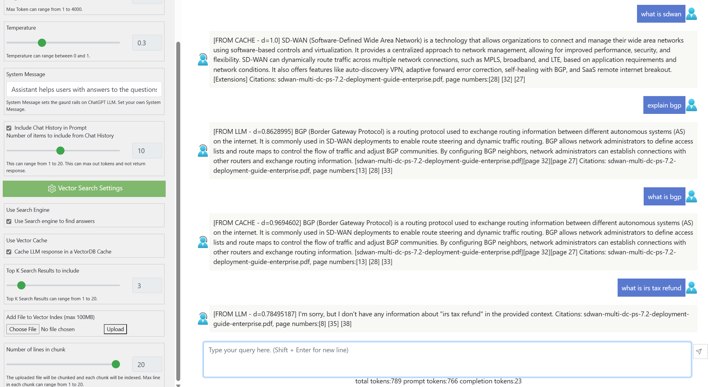

# ChatGPTOnAzure

A react based web app that uses Azure Durable Functions to connect to Azure Open AI. 
It can ingest documents and create a vector index using Azure Cognitive Search. 
It uses Semantic Cache to cache LLM response to reduce LLM traffic for frequently used questions and reduces LLM calls. 
It has options to use Faiss for in-memory cache for low volume data and Azure Cognitive Search Vector DB for high volume data. 

## Prerequisites

To deploy this web app and azure functions using a single cli command:
- az cli installed.
- Azure Functions Core tools installed.
- bash with jq installed. Azure Cloud shell can be used. 
- Azure Open AI resource created and ChatGPT turbo and text-ada-embedding-002 models deployed. 
- Azure Form Recognizer resource deployed.
- Deployment user needs to have Azure Active Directory Service Principal create permissions and grant admin consent to API permissions.
- Azure Resource Group creation and contributor permissions.
- npm react-script package installed.

## Run locally
To deploy locally, run the below commands. Rename local.settings-rename.json to local.settings.json.
Update the values for the below keys in local.settings.json.

{
    "AzureWebJobsStorage": "your_storage_connection_string",
    "FUNCTIONS_WORKER_RUNTIME": "python",
    "AzureWebJobsFeatureFlags": "",
    "AFR_ENDPOINT": "your_afr_endpoint",
    "AFR_API_KEY": "your_afr_api_key",
    "OPENAI_RESOURCE_ENDPOINT": "your_openai_resource_endpoint",
    "OPENAI_EMBEDDING_MODEL": "your_openai_embedding_model",
    "OPENAI_API_KEY": "your_openai_api_key",
    "OPENAI_API_VERSION": "your_openai_api_version",
    "AZSEARCH_EP": "your_azsearch_endpoint",
    "AZSEARCH_KEY": "your_azsearch_key",
    "INDEX_NAME": "your_index_name",
    "VECTOR_INDEX_NAME": "your_vector_index_name",
    "DEPLOYMENT_NAME": "your_deployment_name",
    "OPENAI_MODEL_NAME": "your_openai_model_name",
    "SEMANTIC_CONFIG": "your_semantic_config",
    "CHAT_HISTORY_LOGGING_ENABLED": "true",
    "SYSTEM_MESSAGE": "Welcome to the chat!",
    "SYSTEM_MESSAGE_FOR_SEARCH": "How can I help you?",
    "AzureCosmosDBConnectionString": "your_cosmos_db_connection_string"
}

Run the below commands in CLI like windows powershell or bash. 
    
    git clone https://github.com/anildwarepo/ChatGPTOnAzure

    cd semantic-search-api-durable-functions
    python -m venv .venv
    pip install -r requirements.txt
    func start
    
    cd ..

    cd react-webapp
    npm install
    npm start

git clone https://github.com/anildwarepo/ChatGPTOnAzure

## Deploy ChatGPT on Azure as a Static Website using Azure Storage

To deploy the web app, run the below commands in bash CLI as shown.

    git clone https://github.com/anildwarepo/ChatGPTOnAzure
    az login
    az extension add --name authV2

    cd ChatGPTOnAzure

    # Rename deploy.config.txt.rename 
    mv deploy.config.txt.rename deploy.config.txt

    # update args values in deploy.config.txt one per line using text editor.

    chmod +x deploy.sh
    ./deploy.sh 
    

### (Optional) Deploy only the Function app.
The function app can be deployed using the below func cli. Azure Functions Cli can be installed from [here](https://learn.microsoft.com/en-us/azure/azure-functions/functions-run-local?tabs=v4%2Clinux%2Ccsharp%2Cportal%2Cbash#install-the-azure-functions-core-tools).

    
    cd backend
    #modify database and collections names in chatapi/function.json
            "databaseName": "logging-db",
            "collectionName": "openai-logs",
    #deploy function app
    FUNC_NAME="<name of function>"
    func azure functionapp publish $FUNC_NAME --force --python

## Configuration AAD Authentication
This support supports AAD authentication on both react web app and Azure functions using oauth. 
To configure AAD authentication, update C:\source\repos\ChatGPTOnAzure\react-webapp\src\config.json and change "UseAADAuth": false to 
"UseAADAuth": true.

You can then run deploy.sh as shown above to deploy the apps to Azure. 

## Create Vector Index and ingest documents right from the UI. 

## Semantic Cache in action

