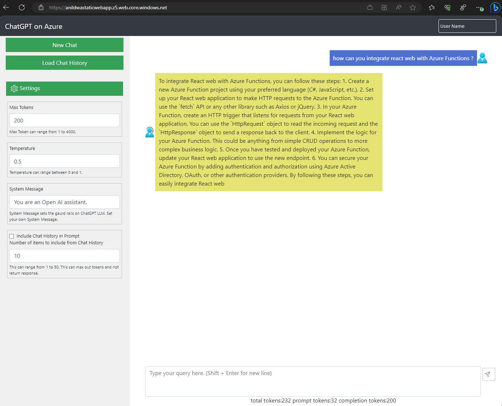

# ChatGPTOnAzure

A react based web app that uses Azure Functions to connect to Azure Open AI. 

## Prerequisites

To deploy this web app and azure functions using a single cli command:
- az cli installed.
- Azure Functions Core tools installed.
- bash with jq installed. Azure Cloud shell can be used. 
- Azure Open AI resource created and ChatGPT turbo model deployed. 
- Deployment user needs to have Azure Active Directory Service Principal create permissions and grant admin consent to API permissions.
- Azure Resource Group creation and contributor permissions.
- npm react-script package installed.

## Deploy ChatGPT on Azure Webapp

To deploy the web app, run the below commands in bash CLI as shown.

    git clone https://github.com/anildwarepo/ChatGPTOnAzure
    az login
    az extension add --name authV2

    cd ChatGPTOnAzure

    chmod +x deploy.sh
    ./deploy.sh <resource-group-name>  <region>  <Azure Open AI Endpoint> <Azure Open AI Key> <Azure Open AI Model Deployment Name> <funcapp_name>  <Azure Cosmos DB Account name>

    For e.g
    ./deploy.sh chatgpt-webapp-rg  westus2 https://openairesourcename.openai.azure.com/ key1 gpt-35-turbo chatgptwebapp1 chatgptwebapp1store cosmosdb-chat

### (Optional) Deploy only the Function app.
The function app can be deployed using the below func cli. Azure Functions Cli can be installed from [here](https://learn.microsoft.com/en-us/azure/azure-functions/functions-run-local?tabs=v4%2Clinux%2Ccsharp%2Cportal%2Cbash#install-the-azure-functions-core-tools).

    
    cd backend
    #modify database and collections names in chatapi/function.json
            "databaseName": "logging-db",
            "collectionName": "openai-logs",
    #deploy function app
    FUNC_NAME="<name of function>"
    func azure functionapp publish $FUNC_NAME --force --python